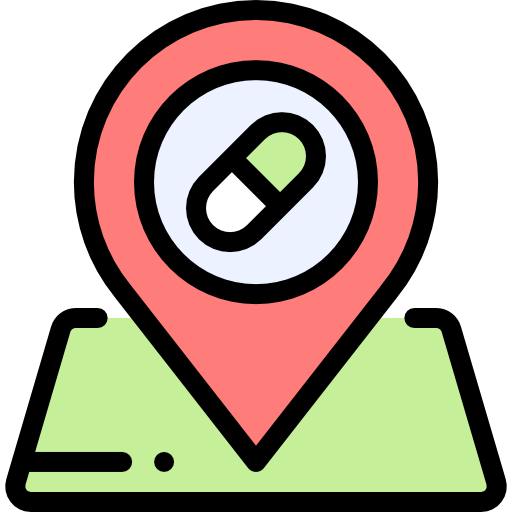

<div id="top"></div>

[![LinkedIn][linkedin-shield]][linkedin-url]
[![Playstore][Play-store]][Playstore-url]


<!-- PROJECT LOGO -->
<br />
<div align="center">
  <a href="#">
    
  </a>

  <h3 align="center">PHATMACIE DE GARDE</h3>

  <p align="center">
    The Pharmacies de Garde Morocco application allows you to search in a precise and/or exact way (Use maps) in real time all the pharmacies on guard day and night in several Moroccan cities
   
  </p>
</div>


<!-- TABLE OF CONTENTS -->
<details>
  <summary>Table of Contents</summary>
  <ol>
    <li>
      <a href="#about-the-project">About The Project</a>
      <ul>
        <li><a href="#built-with">Built With</a></li>
        <li><a href="#prerequisites">Dependencies</a></li>
      </ul>
    </li>
    <li>
      <a href="#getting-started">Getting Started</a>
      <ul>
        <li><a href="#installation">Installation</a></li>
      </ul>
    </li>
  </ol>
</details>


<!-- ABOUT THE PROJECT -->
## About The Project
[![Product Name Screen Shot][product-screenshot]](https://example.com)

This project is a design only , linked with Json for User Experience
The full project is available on the Play Store and linked to firebase cloud and firebase realtime To try the app <a href="#about-the-project">Play Store</a>


<p align="right">(<a href="#top">back to top</a>)</p>


### Built With
* [Flutter 3.0.3](https://flutter.dev/)
* [Dart 2.17.5](https://dart.dev/)
#### Dependencies
* [Flutter_screenutil](https://pub.dev/packages/flutter_screenutil)
* [Flutter_svg](https://pub.dev/packages/flutter_svg)
*  flutter_screenutil: ^5.5.3+2
*  flutter_svg: ^1.1.1+1
*  google_mobile_ads: ^1.3.0
*  get: ^4.6.5

<p align="right">(<a href="#top">back to top</a>)</p>


<!-- GETTING STARTED -->
## Getting Started

### Installation

1. Get the Flutter SDK [https://docs.flutter.dev/get-started/install/windows](https://docs.flutter.dev/get-started/install/windows)
2. Clone the repo
   ```sh
   git clone https://github.com/hboudanes/pharmacie_de_garde_UI
   ```
3. Install packages
   ```sh
   flutter pub get
   ```


<p align="right">(<a href="#top">back to top</a>)</p>


<!-- CONTACT -->
## Contact

Boudanes hicham - [Linkdedin](https://www.linkedin.com/in/hicham-boudanes/) - Hicham.boudanes@gmail.com


<p align="right">(<a href="#top">back to top</a>)</p>


<!-- MARKDOWN LINKS & IMAGES -->
<!-- https://www.markdownguide.org/basic-syntax/#reference-style-links -->

[linkedin-shield]: https://img.shields.io/badge/-LinkedIn-black.svg?style=for-the-badge&logo=linkedin&colorB=555
[linkedin-url]: https://www.linkedin.com/in/hicham-boudanes/
[product-screenshot]: asset/image/screen.png
[Play-store]: https://img.shields.io/badge/Google_Play-414141?style=for-the-badge&logo=google-play&logoColor=white
[Playstore-url]: https://play.google.com/store/apps/details?id=com.pharmacie.garde.maroc